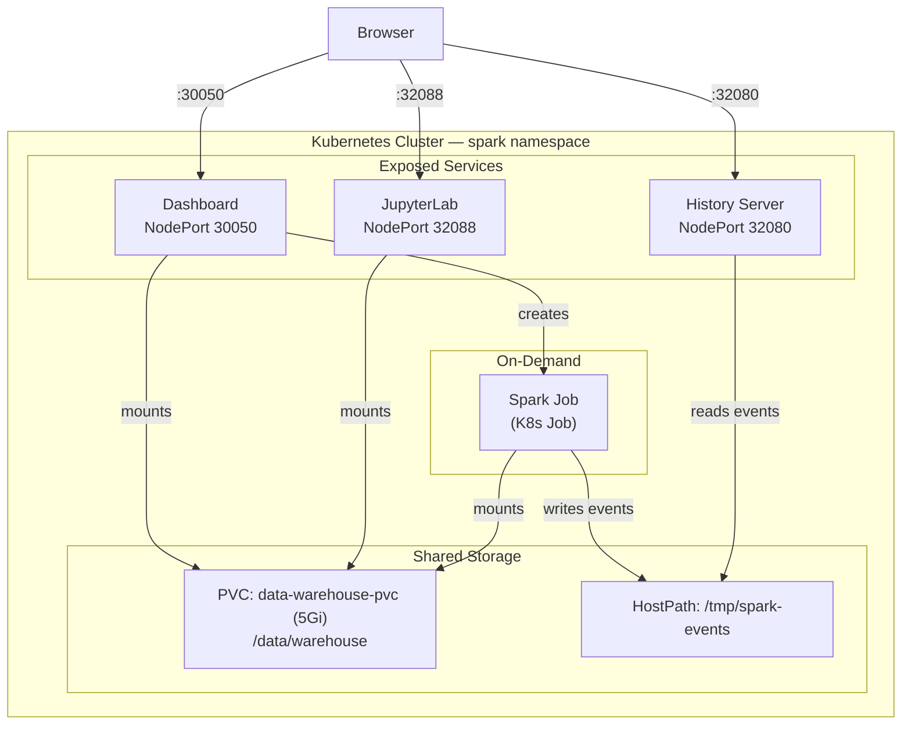

# Spark K8s Sandbox

A fully containerized Kubernetes-based analytics platform for running Apache Spark jobs with **Delta Lake** and **Apache Iceberg** support. The sandbox provides interactive notebooks (JupyterLab), a web dashboard for job management, and a Spark History Server — all orchestrated within a single Kubernetes namespace.

## Architecture



### Components

| Component | Description | Port |
|---|---|---|
| **Dashboard** | Flask web UI — upload jobs and data, monitor pods, view logs, proxy Spark UI | `30050` |
| **JupyterLab** | Interactive notebooks with PySpark, Delta Lake, and Iceberg pre-configured | `32088` |
| **Spark History Server** | Browse metrics and details of completed Spark applications | `32080` |
| **Data Warehouse (PVC)** | 5Gi persistent volume shared across all components | — |
| **Spark Jobs** | On-demand Kubernetes Jobs created by the dashboard | — |

## Prerequisites

- **Docker** — to build container images
- **Kubernetes cluster** — Docker Desktop (with K8s enabled), minikube, or kind
- **kubectl** — configured to talk to your cluster
- **make** — to run build and deploy commands

> **minikube users:** Run `eval $(minikube docker-env)` before building so images are available to the cluster.
>
> **kind users:** After building, load images with `kind load docker-image spark-sandbox:latest spark-dashboard:latest`.

## Quick Start

```bash
# 1. Clone the repository
git clone <repo-url> && cd spark-k8-sandbox

# 2. Build Docker images
make build

# 3. Deploy everything to Kubernetes
make setup

# 4. Verify pods are running
make status
```

Once all pods show `Running`:

| Service | URL |
|---|---|
| Dashboard | [http://localhost:30050](http://localhost:30050) |
| JupyterLab | [http://localhost:32088](http://localhost:32088) |
| Spark History Server | [http://localhost:32080](http://localhost:32080) |

### First Steps

1. Open **JupyterLab** and navigate to `notebooks/getting_started.ipynb`
2. Run through the cells to explore Delta Lake and Iceberg operations
3. Open the **Dashboard** and upload a CSV file to the landing zone
4. Read it from a notebook: `spark.read.csv("/data/warehouse/landing/your_file.csv")`

## Project Structure

```
spark-k8-sandbox/
├── dashboard/                     Web dashboard service
│   ├── Dockerfile                 Dashboard container image
│   ├── app.py                     Flask API + Spark UI proxy
│   ├── requirements.txt           Python dependencies
│   └── templates/
│       └── index.html             Single-page frontend
│
├── k8s/                           Kubernetes manifests
│   ├── namespace.yml              spark namespace
│   ├── rbac.yml                   ServiceAccounts + Roles
│   ├── data-warehouse.yml         5Gi PersistentVolumeClaim
│   ├── jupyter.yml                Jupyter Deployment + Service
│   ├── dashboard.yml              Dashboard RBAC + Deployment + Service
│   └── spark-history-server.yml   History Server Deployment + Service
│
├── jobs/                          Spark job scripts
│   └── simple_counter.py          Example: RDD + DataFrame operations
│
├── notebooks/                     Jupyter notebooks (seeded to PVC)
│   ├── getting_started.ipynb      Delta + Iceberg tutorial
│   └── lastfm_sessions.ipynb      Session detection analytics challenge
│
├── docs/                          Detailed documentation
│   ├── kubernetes-architecture.md
│   ├── docker-images.md
│   ├── spark-configuration.md
│   ├── dashboard.md
│   ├── jupyter-notebooks.md
│   └── data-warehouse.md
│
├── Dockerfile                     Base image (Spark + Delta + Iceberg + Jupyter)
├── Makefile                       Build, deploy, and manage commands
├── spark-defaults.conf            Spark runtime configuration
└── README.md                      This file
```

## Detailed Documentation

| Document | What it covers |
|---|---|
| [Kubernetes Architecture](docs/kubernetes-architecture.md) | Namespace, RBAC, all six manifests, services, health probes, resource limits |
| [Docker Images](docs/docker-images.md) | Both Dockerfiles, base images, JARs, pip packages, build commands |
| [Spark Configuration](docs/spark-configuration.md) | spark-defaults.conf, Delta Lake & Iceberg catalogs, job execution model, code examples |
| [Dashboard](docs/dashboard.md) | API reference, Spark UI proxy, job lifecycle, ConfigMap storage model |
| [Jupyter Notebooks](docs/jupyter-notebooks.md) | Notebook catalog, Spark integration, seeding process, adding custom notebooks |
| [Data Warehouse](docs/data-warehouse.md) | PVC storage layout, landing zone pattern, Delta/Iceberg paths, data flow |

## Makefile Reference

### Build

| Command | Description |
|---|---|
| `make build` | Build both Docker images |
| `make build-sandbox` | Build `spark-sandbox:latest` |
| `make build-dashboard` | Build `spark-dashboard:latest` |

### Deploy

| Command | Description |
|---|---|
| `make setup` | **First-time setup** — create namespace, RBAC, and deploy all services |
| `make apply-infra` | Create namespace and RBAC only |
| `make apply` | Deploy all services (namespace must exist) |
| `make deploy` | Build images + apply all manifests |
| `make deploy-sandbox` | Rebuild sandbox image + restart Jupyter |
| `make deploy-dashboard` | Rebuild dashboard image + restart dashboard |

### Restart

| Command | Description |
|---|---|
| `make restart` | Restart all deployments |
| `make restart-dashboard` | Restart dashboard only |
| `make restart-jupyter` | Restart Jupyter only |
| `make restart-history` | Restart History Server only |

### Observe

| Command | Description |
|---|---|
| `make status` | List all pods in the spark namespace |
| `make logs` | Tail dashboard logs |
| `make logs-jupyter` | Tail Jupyter logs |
| `make logs-history` | Tail History Server logs |

### Cleanup

| Command | Description |
|---|---|
| `make clean-jobs` | Delete all Spark job runs |
| `make clean` | **Delete the entire namespace** (destroys PVC data) |

## Data Lake Engines

The sandbox ships with two data lake table formats pre-configured and ready to use:

### Delta Lake

- **Version:** 3.2.1
- **Catalog:** `spark_catalog` (default) — path-based
- **Storage:** `/data/warehouse/delta/`
- **Key features:** ACID transactions, time travel, upserts (MERGE INTO), table history

```python
# Write
df.write.format("delta").mode("overwrite").save("/data/warehouse/delta/my_table")

# Read with time travel
spark.read.format("delta").option("versionAsOf", 0).load("/data/warehouse/delta/my_table")
```

### Apache Iceberg

- **Version:** 1.6.1
- **Catalog:** `local` — Hadoop filesystem-backed
- **Storage:** `/data/warehouse/iceberg/`
- **Key features:** Schema evolution, snapshot-based time travel, catalog management

```python
# Create and query via SQL
spark.sql("CREATE NAMESPACE IF NOT EXISTS local.mydb")
spark.sql("CREATE TABLE local.mydb.events (id INT, name STRING) USING iceberg")
spark.sql("INSERT INTO local.mydb.events VALUES (1, 'click')")
spark.table("local.mydb.events").show()
```

See [Spark Configuration](docs/spark-configuration.md) for full setup details, catalog architecture, and code examples.
