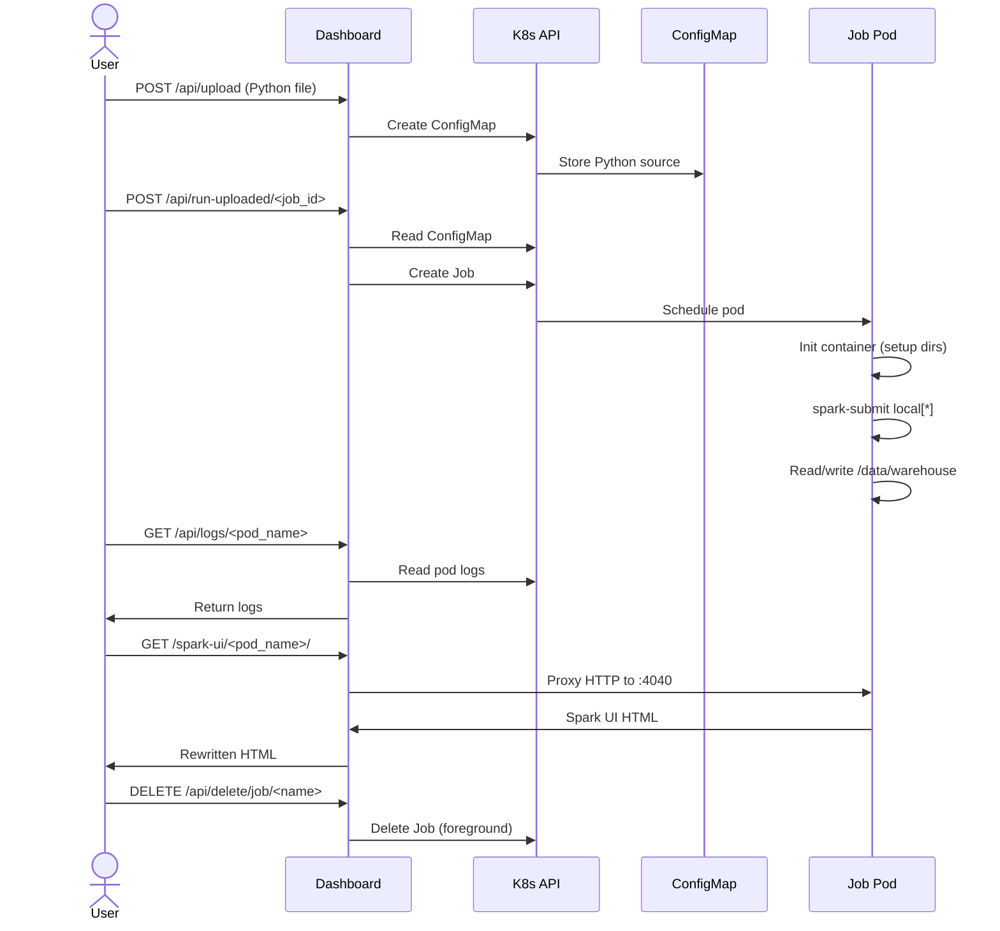
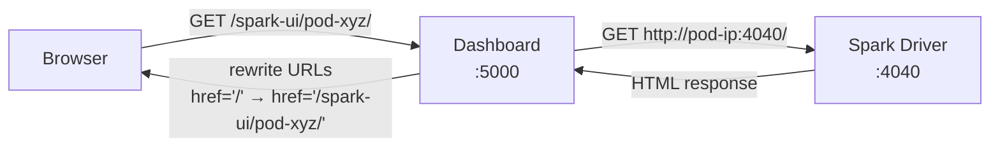
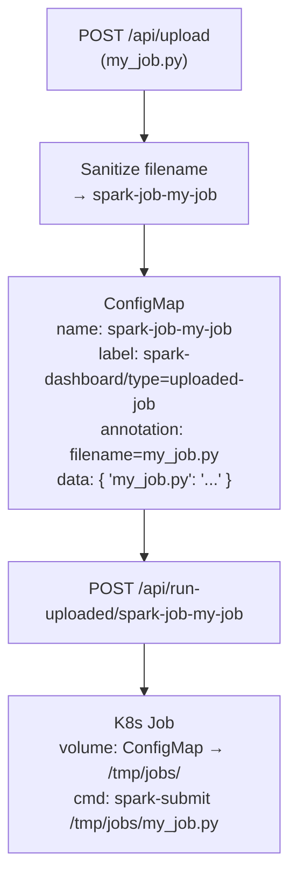

# Dashboard

The dashboard is a Flask web application that provides a graphical interface for managing Spark jobs, uploading data, and monitoring the cluster — all without touching `kubectl`.

## Technology Stack

| Component | Technology | Version |
|---|---|---|
| Web Framework | Flask | 3.0.3 |
| WSGI Server | Gunicorn | 21.2.0 (2 workers, 4 threads) |
| K8s Client | kubernetes (Python) | 28.1.0 |
| Frontend | Vanilla JavaScript + CSS | No framework |

**Source files:**
- [`dashboard/app.py`](../dashboard/app.py) — Flask application (API + Spark UI proxy)
- [`dashboard/templates/index.html`](../dashboard/templates/index.html) — Single-page frontend
- [`dashboard/requirements.txt`](../dashboard/requirements.txt) — Python dependencies
- [`dashboard/Dockerfile`](../dashboard/Dockerfile) — Container image build

## Access

| Property | Value |
|---|---|
| **URL** | `http://localhost:30050` |
| **Internal Port** | 5000 |
| **NodePort** | 30050 |

## Job Lifecycle

The dashboard manages the full lifecycle of a Spark job — from upload through execution to cleanup:



### Step-by-step

1. **Upload** — User uploads a `.py` file. The dashboard stores it as a Kubernetes ConfigMap with the label `spark-dashboard/type: uploaded-job`. The original filename is preserved in an annotation.

2. **Execute** — User clicks "Run". The dashboard reads the ConfigMap, then creates a Kubernetes Job with:
   - An **init container** that sets up the `/data/warehouse` directory structure
   - A **main container** running `spark-submit --master local[*]` against the mounted script
   - Three volume mounts: the job script (from ConfigMap), the data warehouse (PVC), and spark events (hostPath)

3. **Monitor** — While the job runs, the user can:
   - View **pod logs** via the Logs button (configurable tail: 50/100/200/500 lines)
   - Access the **Spark UI** through the dashboard's reverse proxy (port 4040)

4. **Cleanup** — Completed jobs can be deleted individually or all at once (`make clean-jobs`).

## API Reference

### Status & Monitoring

| Method | Endpoint | Description |
|---|---|---|
| `GET` | `/` | Serve the dashboard frontend (HTML) |
| `GET` | `/api/status` | List all pods and jobs in the namespace with status counts |
| `GET` | `/api/logs/<pod_name>?lines=N` | Fetch tail of pod logs (default: 100 lines) |
| `GET` | `/spark-ui/<pod_name>/` | Reverse proxy to Spark driver UI (port 4040) |
| `GET` | `/spark-ui/<pod_name>/<path>` | Proxy sub-paths (CSS, JS, API calls) |

### Job Management

| Method | Endpoint | Description |
|---|---|---|
| `GET` | `/api/uploaded-jobs` | List all uploaded job ConfigMaps |
| `POST` | `/api/upload` | Upload a `.py` file (multipart form, field: `file`) |
| `POST` | `/api/run-uploaded/<job_id>` | Execute an uploaded job as a Kubernetes Job |
| `DELETE` | `/api/delete/job/<job_name>` | Delete a job run and its pod |
| `DELETE` | `/api/delete/uploaded/<job_id>` | Delete an uploaded job ConfigMap |

### Data Management

| Method | Endpoint | Description |
|---|---|---|
| `GET` | `/api/warehouse/landing` | List files in the landing zone with sizes and timestamps |
| `POST` | `/api/upload-data` | Upload a data file to the landing zone (multipart form, field: `file`) |
| `DELETE` | `/api/warehouse/landing/<filename>` | Delete a file from the landing zone |

## Spark UI Proxy

The dashboard includes a reverse proxy that makes the Spark driver UI (port 4040) accessible through the dashboard's own URL, avoiding the need to expose each job pod individually.

**How it works:**



1. The dashboard resolves the pod's cluster IP via the Kubernetes API
2. It forwards the request to `http://<pod_ip>:4040/<subpath>`
3. For HTML responses, it rewrites all absolute URLs (`href="/..."`, `src="/..."`) to include the `/spark-ui/<pod_name>/` prefix
4. Non-HTML responses (CSS, JS, images) are streamed directly

> The Spark UI is only available while the job is **running**. Once the job completes, the driver pod terminates and the UI becomes unavailable. Use the [Spark History Server](../README.md) (`http://localhost:32080`) for post-execution analysis.

## ConfigMap Storage Model

Uploaded Python scripts are stored as Kubernetes ConfigMaps rather than files on the PVC:



**Filename sanitization:**
1. Remove `.py` extension
2. Replace underscores with hyphens
3. Replace invalid characters with hyphens
4. Collapse consecutive hyphens
5. Prefix with `spark-job-`

Example: `My_Data_Pipeline.py` → `spark-job-my-data-pipeline`

## Frontend Features

The dashboard frontend is a single-page application built with vanilla JavaScript:

- **Dark theme** — custom CSS with dark background and high-contrast elements
- **Auto-refresh** — polls `/api/status` and `/api/uploaded-jobs` every 15 seconds
- **Status cards** — shows pod counts broken down by phase (Running, Pending, Completed, Failed)
- **Job upload** — drag-and-drop or click to upload `.py` files
- **Data upload** — upload CSV, TSV, Parquet, or any data file to the landing zone
- **Job execution** — one-click job launch from uploaded scripts
- **Pod logs viewer** — modal with configurable tail lines (50/100/200/500)
- **Spark UI link** — direct link to the proxied Spark UI for running jobs
- **Landing zone browser** — list, inspect, and delete uploaded data files
- **Toast notifications** — non-blocking success/error messages

## RBAC

The dashboard runs under the `spark-dashboard` ServiceAccount with scoped permissions:

| Resource | Allowed Verbs |
|---|---|
| `pods`, `pods/log` | `get`, `list`, `watch`, `delete` |
| `configmaps` | `get`, `list`, `watch`, `create`, `delete` |
| `services` | `get`, `list`, `watch`, `create`, `delete` |
| `jobs` (batch API) | `get`, `list`, `watch`, `create`, `delete` |

The dashboard **cannot** `update` or `patch` existing resources — it can only create new ones or delete them. This is a deliberate security boundary to prevent accidental modification of running workloads.

## Kubernetes Client Configuration

The Flask app auto-detects its environment:

```python
try:
    config.load_incluster_config()   # When running inside K8s
except Exception:
    config.load_kube_config()        # When running locally for development
```

In-cluster config uses the mounted ServiceAccount token at `/var/run/secrets/kubernetes.io/serviceaccount/token`.

---

[Back to README](../README.md)
