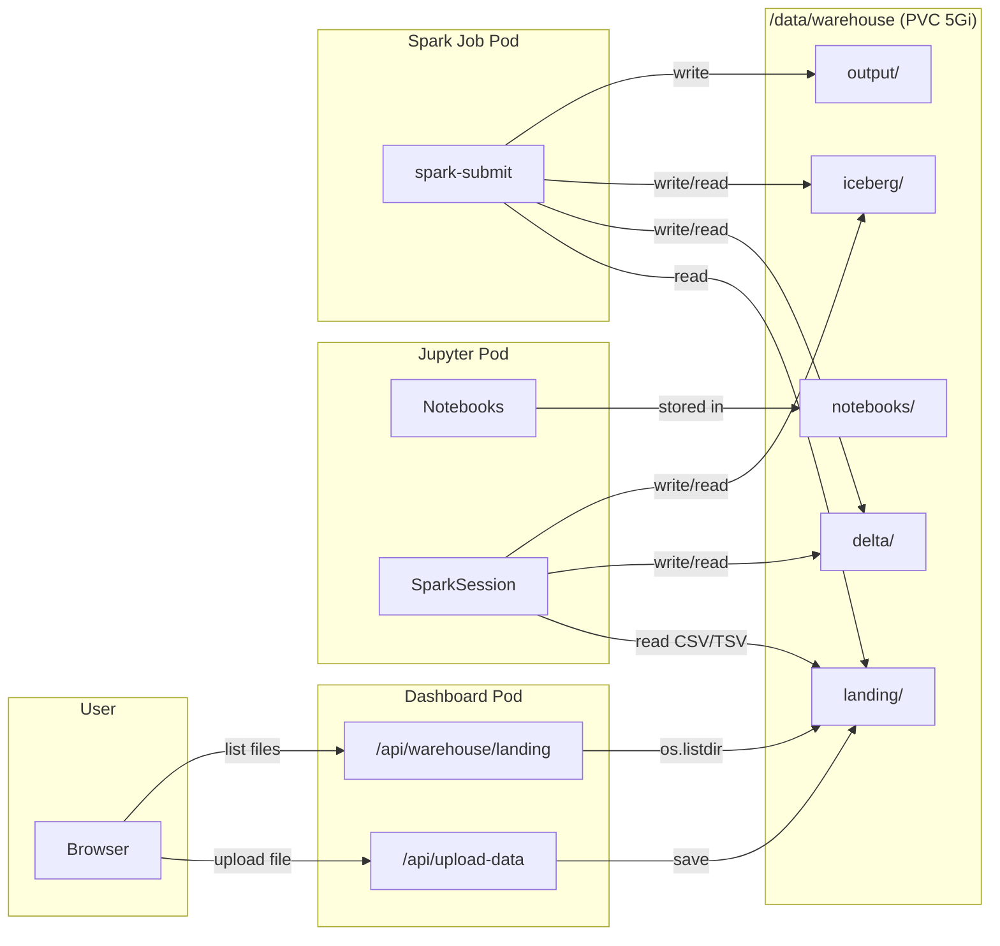
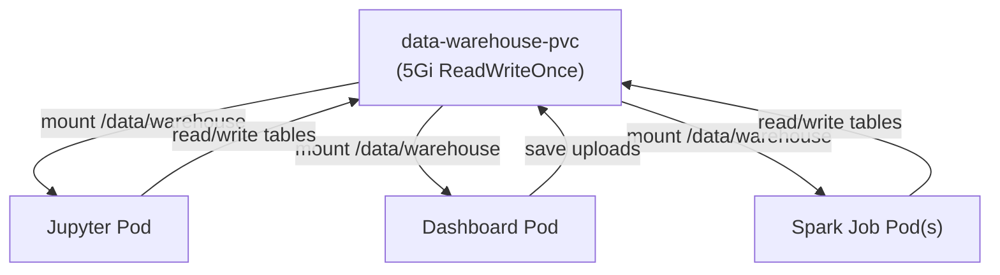

# Data Warehouse Architecture

The data warehouse is the shared storage backbone of the sandbox. Every component — JupyterLab, batch Spark jobs, and the dashboard — reads and writes to the same Kubernetes Persistent Volume, making data instantly available across the entire platform.

## Persistent Volume Claim

Defined in [`k8s/data-warehouse.yml`](../k8s/data-warehouse.yml):

| Property | Value |
|---|---|
| **Name** | `data-warehouse-pvc` |
| **Namespace** | `spark` |
| **Access Mode** | `ReadWriteOnce` |
| **Capacity** | `5Gi` |
| **Storage Class** | Default (cluster-provided) |
| **Mount Path** | `/data/warehouse` |

> **ReadWriteOnce** means the volume can be mounted read-write by pods on a **single node**. In a local development cluster (Docker Desktop, minikube, kind) this is sufficient since all pods schedule on the same node.

## Directory Layout

```
/data/warehouse/
├── landing/          Raw files uploaded via the dashboard
├── delta/            Delta Lake tables (path-based)
├── iceberg/          Iceberg tables (catalog: "local")
├── output/           General-purpose job output
└── notebooks/        Jupyter notebooks (seeded from image)
```

All directories are created by **init containers** at pod startup with `chmod -R 777` permissions so that both the `spark` user (UID 185) and `root` can read and write freely.

## Data Flow



## Landing Zone

The landing zone (`/data/warehouse/landing/`) is the ingestion point for raw data files.

**How files arrive:**
1. Navigate to the dashboard at `http://localhost:30050`
2. Use the **Upload Data** panel to upload CSV, TSV, Parquet, or any file
3. The dashboard saves the file to `/data/warehouse/landing/<filename>` via the `POST /api/upload-data` endpoint

**How files are consumed:**
- In **Jupyter notebooks** — read with `spark.read.csv(...)`, `spark.read.parquet(...)`, etc.
- In **batch jobs** — same Spark read APIs, since the PVC is mounted at the same path

**Example (reading a CSV in a notebook):**
```python
df = (
    spark.read
    .option("header", "true")
    .option("inferSchema", "true")
    .csv("/data/warehouse/landing/my_data.csv")
)
df.show(5)
```

**Managing landing files:**
- `GET /api/warehouse/landing` — list all files with sizes and timestamps
- `DELETE /api/warehouse/landing/<filename>` — remove a file

## Delta Lake Storage

**Path:** `/data/warehouse/delta/`

Delta Lake tables are **path-based** — you read and write by pointing Spark at a directory. No catalog registration is needed because `spark_catalog` is already configured as `DeltaCatalog` in `spark-defaults.conf`.

**Key capabilities:**
- **ACID transactions** — concurrent reads and writes are safe
- **Time travel** — read any previous version with `option("versionAsOf", N)`
- **Upserts** — use `DeltaTable.forPath(...).merge(...)` for MERGE operations
- **History** — `DeltaTable.forPath(...).history()` shows all committed versions

**Example (write + time-travel):**
```python
# Write
df.write.format("delta").mode("overwrite").save("/data/warehouse/delta/my_table")

# Read latest
spark.read.format("delta").load("/data/warehouse/delta/my_table").show()

# Read version 0
spark.read.format("delta").option("versionAsOf", 0).load("/data/warehouse/delta/my_table").show()
```

Each Delta table lives in its own subdirectory under `/data/warehouse/delta/`. The `_delta_log/` subfolder within each table directory contains the transaction log.

## Iceberg Storage

**Path:** `/data/warehouse/iceberg/`

Iceberg tables use the pre-configured **`local` catalog** (a `HadoopCatalog` backed by the filesystem). Tables are addressed as `local.<namespace>.<table>`.

**Key capabilities:**
- **Catalog-based** — tables are managed through SQL DDL (`CREATE TABLE`, `ALTER TABLE`)
- **Schema evolution** — add, drop, or rename columns without rewriting data
- **Time travel** — query by snapshot ID
- **Snapshot history** — `SELECT * FROM <table>.snapshots`

**Example:**
```python
# Create namespace and table
spark.sql("CREATE NAMESPACE IF NOT EXISTS local.mydb")
spark.sql("""
    CREATE TABLE IF NOT EXISTS local.mydb.events (
        id INT, name STRING, value DOUBLE
    ) USING iceberg
""")

# Insert
spark.sql("INSERT INTO local.mydb.events VALUES (1, 'click', 3.14)")

# Query
spark.table("local.mydb.events").show()

# View snapshot history
spark.sql("SELECT * FROM local.mydb.events.snapshots").show()
```

The physical files are organized by Iceberg's metadata layer under `/data/warehouse/iceberg/<namespace>/<table>/`.

## Shared Access Model



All three pod types mount the **same PVC** at `/data/warehouse`. This means:

- A notebook can query Delta tables written by a batch job
- A batch job can read files uploaded through the dashboard
- Results written by any component are immediately visible to all others

> **Caveat:** Since the PVC uses `ReadWriteOnce`, all pods must be scheduled on the **same node**. In a multi-node cluster, you would need to switch to a `ReadWriteMany`-capable storage class (e.g., NFS, EFS, CephFS).

## Init Container Setup

Every deployment that mounts the warehouse PVC includes an init container that ensures the directory structure exists:

```bash
mkdir -p /data/warehouse/landing \
         /data/warehouse/iceberg \
         /data/warehouse/delta \
         /data/warehouse/output \
         /data/warehouse/notebooks
chmod -R 777 /data/warehouse
```

The init container runs as `root` (`runAsUser: 0`) to guarantee it can create directories and set permissions, regardless of the underlying storage provider's default ownership.

The **Jupyter init container** additionally copies pre-built notebooks from the Docker image:
```bash
cp -n /opt/spark/notebooks/* /data/warehouse/notebooks/ 2>/dev/null || true
```

The `-n` flag ensures existing notebooks are **never overwritten**, so user modifications are preserved across restarts.

---

[Back to README](../README.md)
