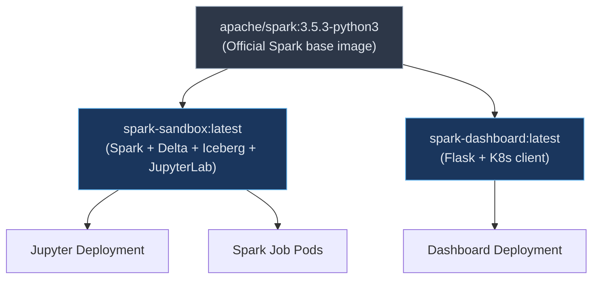

# Docker Images

The sandbox builds two custom Docker images from a common base. Neither image is pushed to a registry — they are built locally and used directly by Kubernetes with `imagePullPolicy: Never`.

## Image Overview



| Image | Dockerfile | Used by | Size drivers |
|---|---|---|---|
| `spark-sandbox:latest` | [`Dockerfile`](../Dockerfile) | Jupyter, Spark Jobs, Init Containers | Spark 3.5.3 + Iceberg + Delta JARs + JupyterLab |
| `spark-dashboard:latest` | [`dashboard/Dockerfile`](../dashboard/Dockerfile) | Dashboard Deployment | Flask + kubernetes Python client |

---

## spark-sandbox Image

**Source:** [`Dockerfile`](../Dockerfile)

This is the multi-purpose workhorse image containing everything needed for both interactive notebooks and batch job execution.

### Base Image

```
apache/spark:3.5.3-python3
```

The official Apache Spark image ships with:
- Java 17 (OpenJDK)
- Python 3
- Spark 3.5.3 binaries (`/opt/spark/`)
- `spark-submit`, `pyspark`, and all core Spark JARs

### Build Layers

#### 1. Data Lake JARs

Three JARs are downloaded into Spark's auto-loaded directory (`/opt/spark/jars/`):

| JAR | Version | Purpose |
|---|---|---|
| `iceberg-spark-runtime-3.5_2.12` | 1.6.1 | Iceberg table format runtime for Spark 3.5 |
| `delta-spark_2.12` | 3.2.1 | Delta Lake core engine |
| `delta-storage` | 3.2.1 | Delta Lake storage utilities |

JARs in `/opt/spark/jars/` are automatically loaded on every Spark session — no `--packages` or `--jars` flags needed.

#### 2. Python Dependencies

```
pip install pyspark==3.5.3 delta-spark==3.2.1 pyiceberg==0.7.1 jupyterlab==4.2.5 ipykernel==6.29.5
```

| Package | Version | Purpose |
|---|---|---|
| `pyspark` | 3.5.3 | Python API for Spark (matches Spark version) |
| `delta-spark` | 3.2.1 | Python bindings for Delta Lake (`DeltaTable` class) |
| `pyiceberg` | 0.7.1 | Python bindings for Iceberg catalog management |
| `jupyterlab` | 4.2.5 | Interactive notebook environment |
| `ipykernel` | 6.29.5 | IPython kernel (connects Jupyter to Python runtime) |

#### 3. Application Files

```
COPY jobs/*.py             → /opt/spark/jobs/       (batch job scripts)
COPY spark-defaults.conf   → /opt/spark/conf/       (Spark runtime config)
COPY notebooks/            → /opt/spark/notebooks/  (seeded to PVC at startup)
```

#### 4. Permissions & User

```dockerfile
RUN chmod -R 755 /opt/spark/jobs/ /opt/spark/notebooks/
RUN chmod 644 /opt/spark/conf/spark-defaults.conf

USER spark                    # Non-root (UID 185)
WORKDIR /opt/spark/jobs
```

The image runs as the non-root `spark` user for security. Init containers temporarily escalate to `root` to set up directory permissions on the PVC.

### Contents Summary

```
/opt/spark/
├── bin/                  Spark binaries (spark-submit, pyspark, etc.)
├── conf/
│   └── spark-defaults.conf   Delta + Iceberg catalog configuration
├── jars/
│   ├── iceberg-spark-runtime-3.5_2.12-1.6.1.jar
│   ├── delta-spark_2.12-3.2.1.jar
│   ├── delta-storage-3.2.1.jar
│   └── (... other Spark JARs from base image)
├── jobs/
│   └── simple_counter.py     Example batch job
└── notebooks/
    ├── getting_started.ipynb  Delta + Iceberg tutorial
    └── lastfm_sessions.ipynb  Complex analytics challenge
```

---

## spark-dashboard Image

**Source:** [`dashboard/Dockerfile`](../dashboard/Dockerfile)

A lightweight Flask application for managing Spark jobs via the Kubernetes API.

### Base Image

```
apache/spark:3.5.3-python3
```

The same Spark base is used (rather than a minimal Python image) so the dashboard can share image layers with the sandbox image, reducing total disk usage on the node.

### Build Layers

#### 1. Python Dependencies

From [`dashboard/requirements.txt`](../dashboard/requirements.txt):

| Package | Version | Purpose |
|---|---|---|
| `flask` | 3.0.3 | Web framework for the dashboard API and UI |
| `kubernetes` | 28.1.0 | Python client for the Kubernetes API (manage pods, jobs, configmaps) |
| `gunicorn` | 21.2.0 | Production WSGI server (replaces Flask's dev server) |

#### 2. Application Files

```
COPY app.py        → /app/app.py           (Flask application)
COPY templates/    → /app/templates/        (HTML template)
```

#### 3. Environment & Entrypoint

```dockerfile
ENV FLASK_APP=app.py
ENV SPARK_NAMESPACE=spark

EXPOSE 5000

CMD ["gunicorn", "--bind", "0.0.0.0:5000", "--workers", "2", "--threads", "4", "app:app"]
```

- **2 workers, 4 threads**: Handles concurrent requests (API polling, Spark UI proxy streaming)
- **Gunicorn** is used instead of Flask's built-in server for stability and concurrency

---

## Build Commands

All builds are orchestrated through the [`Makefile`](../Makefile):

| Command | Action |
|---|---|
| `make build` | Build both images |
| `make build-sandbox` | `docker build -t spark-sandbox:latest .` |
| `make build-dashboard` | `docker build -t spark-dashboard:latest dashboard/` |

### Image Pull Policy

Both images use `imagePullPolicy: Never` in their Kubernetes manifests. This tells the kubelet to **only use locally available images** and never attempt to pull from a container registry.

This is essential for local development clusters where images are built directly on the node:
- **Docker Desktop Kubernetes**: Images built with `docker build` are immediately available
- **minikube**: Use `eval $(minikube docker-env)` before building to target minikube's Docker daemon
- **kind**: Use `kind load docker-image spark-sandbox:latest` to import the image

### Rebuild Workflow

After modifying source code:

```bash
# Rebuild and restart just the component you changed
make deploy-sandbox      # Rebuilds spark-sandbox + restarts Jupyter
make deploy-dashboard    # Rebuilds spark-dashboard + restarts Dashboard

# Or rebuild everything
make deploy              # build + apply all manifests
```

---

[Back to README](../README.md)
