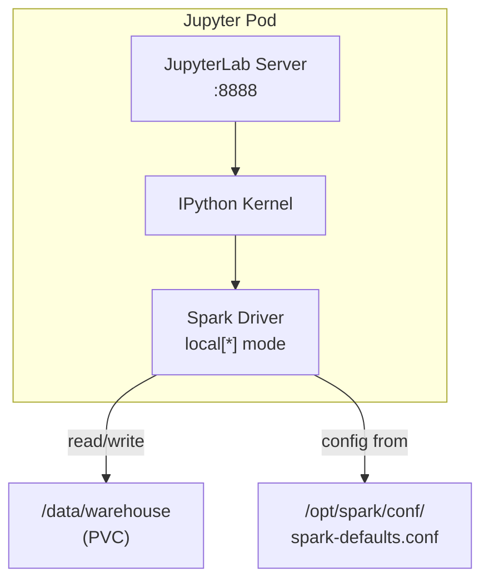
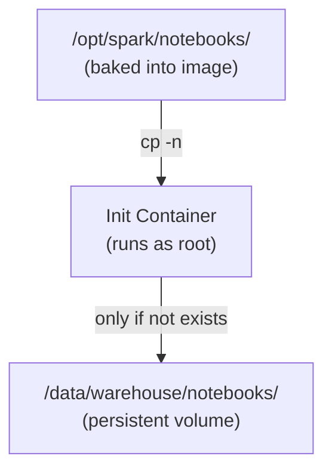

# Jupyter Notebooks

JupyterLab provides the interactive computing environment for the sandbox. It ships with PySpark, Delta Lake, and Iceberg fully configured — open a notebook and start querying immediately.

## Access

| Property | Value |
|---|---|
| **URL** | `http://localhost:32088` |
| **Internal Port** | 8888 |
| **NodePort** | 32088 |
| **Authentication** | Disabled (no token, no password) |
| **Notebook Directory** | `/data/warehouse` |

## How Jupyter Connects to Spark

Jupyter and Spark run in the **same pod**. There is no remote Spark cluster — the notebook creates a local SparkSession directly:



1. JupyterLab starts and registers an IPython kernel
2. When a notebook cell imports PySpark and calls `SparkSession.builder.getOrCreate()`, a Spark driver starts inside the same JVM
3. `spark-defaults.conf` is automatically loaded, registering Delta and Iceberg extensions
4. All operations run in `local[*]` mode using the pod's allocated CPU cores

**Minimal notebook setup:**
```python
from pyspark.sql import SparkSession

spark = (
    SparkSession.builder
    .master("local[*]")
    .appName("MyNotebook")
    .getOrCreate()
)

# Delta and Iceberg catalogs are ready — no .config() calls needed
spark.version
```

## Pre-loaded Notebooks

Two notebooks are bundled with the sandbox and automatically seeded to the PVC on first startup:

### 1. `getting_started.ipynb` — Sandbox Tutorial

**Location:** `/data/warehouse/notebooks/getting_started.ipynb`

A step-by-step onboarding guide covering the four core capabilities:

| Section | Topic | What you'll learn |
|---|---|---|
| 1 — SparkSession | Session setup | Verify extensions are loaded, check config values |
| 2 — Delta Lake | Write, read, merge, time-travel | Path-based Delta operations with `DeltaTable` API |
| 3 — Iceberg | Create, insert, evolve, time-travel | Catalog-based Iceberg operations via SQL and the `local` catalog |
| 4 — Landing Zone | List and read uploaded files | `os.listdir()` + `spark.read.csv()` pattern |

**Key concepts demonstrated:**
- Delta Lake `MERGE INTO` for upserts
- Delta time travel with `option("versionAsOf", N)`
- Iceberg namespace and table creation via Spark SQL
- Iceberg schema evolution (`ALTER TABLE ... ADD COLUMN`)
- Iceberg snapshot history and time travel by snapshot ID
- Reading CSV files from the landing zone and converting to Delta format

### 2. `lastfm_sessions.ipynb` — Analytics Challenge

**Location:** `/data/warehouse/notebooks/lastfm_sessions.ipynb`

A real-world analytical challenge using the Last.fm 1K Users dataset:

> **Question:** What are the top 10 songs played in the top 50 longest listening sessions?

| Step | Operation | Spark concepts used |
|---|---|---|
| 1 — Load | Parse TSV, cast timestamps | `spark.read.csv()` with `sep=\t` |
| 2 — Sessionize | Detect 20-minute gaps | `lag()`, `Window.partitionBy().orderBy()`, `F.unix_timestamp()`, cumulative `sum()` |
| 3 — Rank | Find top 50 sessions by track count | `groupBy().agg(count)`, `orderBy().limit(50)` |
| 4 — Top songs | Count songs across top sessions | `join()`, `groupBy().agg(count)` |
| 5 — Persist | Write results as Delta tables | `df.write.format("delta")` |

**Prerequisites:** Download the dataset from the [Last.fm website](http://ocelma.net/MusicRecommendationDataset/lastfm-1K.html) and upload the TSV file via the dashboard's landing zone.

## Notebook Seeding Process

Notebooks are copied from the Docker image to the PVC by the Jupyter pod's **init container**:



The `cp -n` flag (no-clobber) means:
- **First deployment:** Notebooks are copied from the image to the PVC
- **Subsequent restarts:** Existing notebooks are preserved — your edits are never overwritten
- **Image update:** New notebooks are only copied if they don't already exist on the PVC. To force an update, delete the notebook from the PVC first.

## Adding Custom Notebooks

### Option 1: Create in JupyterLab

1. Open JupyterLab at `http://localhost:32088`
2. Navigate to the `notebooks/` directory in the file browser
3. Click **File → New → Notebook**
4. The notebook is saved to the PVC and persists across restarts

### Option 2: Bundle in the Docker Image

1. Add your `.ipynb` file to the `notebooks/` directory in the repository
2. Rebuild the image: `make build-sandbox`
3. Delete the existing notebook from the PVC (if upgrading): remove it via JupyterLab's file browser
4. Restart Jupyter: `make restart-jupyter`
5. The init container copies the new notebook to the PVC

### Option 3: Upload via Dashboard

1. Upload the `.ipynb` file as a data file via `POST /api/upload-data`
2. It lands in `/data/warehouse/landing/`
3. Move it to `/data/warehouse/notebooks/` from within a Jupyter terminal

## Environment Details

| Property | Value |
|---|---|
| **Image** | `spark-sandbox:latest` |
| **JupyterLab version** | 4.2.5 |
| **IPython kernel** | 6.29.5 |
| **Spark version** | 3.5.3 |
| **Python version** | 3 (from base image) |
| **Working directory** | `/data/warehouse` |
| **Home directory** | `/tmp/jupyter-home` |
| **SPARK_LOCAL_IP** | `127.0.0.1` |

**Resource allocation:**

| | Request | Limit |
|---|---|---|
| **CPU** | 500m | 2 cores |
| **Memory** | 1Gi | 2Gi |

The Jupyter pod has the largest resource allocation in the sandbox because it runs both the notebook server and a full Spark driver concurrently.

---

[Back to README](../README.md)
