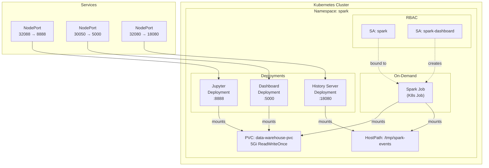
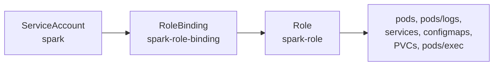
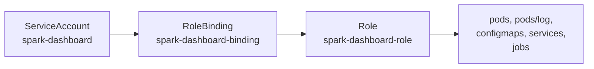

# Kubernetes Architecture

All resources run inside a single `spark` namespace. The cluster hosts three long-running deployments (Jupyter, Dashboard, Spark History Server) plus on-demand Spark job pods created by the dashboard.

## Service Topology



## External Access Points

| Service | Internal Port | NodePort | URL |
|---|---|---|---|
| JupyterLab | 8888 | **32088** | `http://localhost:32088` |
| Dashboard | 5000 | **30050** | `http://localhost:30050` |
| Spark History Server | 18080 | **32080** | `http://localhost:32080` |

> On **minikube**, replace `localhost` with the output of `minikube ip`.

---

## Manifests Reference

The `k8s/` directory contains six manifest files applied in a specific order:

```
k8s/
├── namespace.yml              1. Namespace
├── rbac.yml                   2. ServiceAccounts + Roles + RoleBindings
├── data-warehouse.yml         3. PersistentVolumeClaim
├── spark-history-server.yml   4. History Server Deployment + Service
├── jupyter.yml                5. Jupyter Deployment + Service
└── dashboard.yml              6. Dashboard SA + Role + RoleBinding + Deployment + Service
```

---

### 1. Namespace (`namespace.yml`)

**Source:** [`k8s/namespace.yml`](../k8s/namespace.yml)

Creates the `spark` namespace that isolates all sandbox resources.

```yaml
apiVersion: v1
kind: Namespace
metadata:
  name: spark
  labels:
    app.kubernetes.io/name: spark
    app.kubernetes.io/component: processing
```

All subsequent manifests operate within this namespace.

---

### 2. RBAC (`rbac.yml`)

**Source:** [`k8s/rbac.yml`](../k8s/rbac.yml)

Defines the **spark** ServiceAccount used by Spark job pods for Kubernetes API access.



#### ServiceAccount: `spark`

Bound to Spark job pods via `serviceAccountName: spark`.

#### Role: `spark-role`

| API Group | Resources | Verbs |
|---|---|---|
| `""` (core) | `pods`, `pods/logs`, `services`, `configmaps`, `persistentvolumeclaims` | `create`, `get`, `list`, `watch`, `delete`, `deletecollection`, `update`, `patch` |
| `""` (core) | `pods/exec` | `create`, `get` |

This broad permission set allows Spark (in cluster mode) to dynamically create and manage executor pods, though the current setup uses `local[*]` mode.

---

### 3. Persistent Storage (`data-warehouse.yml`)

**Source:** [`k8s/data-warehouse.yml`](../k8s/data-warehouse.yml)

| Property | Value |
|---|---|
| **Name** | `data-warehouse-pvc` |
| **Access Mode** | `ReadWriteOnce` |
| **Size** | `5Gi` |

Mounted at `/data/warehouse` by Jupyter, Dashboard, and Spark job pods. See [Data Warehouse Architecture](./data-warehouse.md) for the full directory layout and data flow.

---

### 4. Spark History Server (`spark-history-server.yml`)

**Source:** [`k8s/spark-history-server.yml`](../k8s/spark-history-server.yml)

Provides a web UI for reviewing completed Spark applications.

#### Deployment

| Property | Value |
|---|---|
| **Image** | `apache/spark:3.5.3-python3` (unmodified official image) |
| **Replicas** | 1 |
| **Command** | `/opt/spark/sbin/start-history-server.sh` |

**Environment Variables:**

| Variable | Value | Purpose |
|---|---|---|
| `SPARK_HISTORY_OPTS` | `-Dspark.history.fs.logDirectory=/tmp/spark-events -Dspark.history.ui.port=18080` | Points to event log directory |
| `SPARK_NO_DAEMONIZE` | `true` | Keeps the process in the foreground (required for K8s) |

**Init Container:**
- Runs as `root` to `chmod 777 /tmp/spark-events`

**Volume:**
- `spark-events` → `hostPath: /tmp/spark-events` (type: `DirectoryOrCreate`)

> **Note:** Using `hostPath` means event logs do not survive node recreation. In production, use a shared filesystem or object storage (S3, GCS).

#### Service

| Type | Port | NodePort |
|---|---|---|
| `NodePort` | 18080 → 18080 | **32080** |

---

### 5. Jupyter Deployment (`jupyter.yml`)

**Source:** [`k8s/jupyter.yml`](../k8s/jupyter.yml)

Runs JupyterLab with PySpark, Delta Lake, and Iceberg pre-configured.

#### Deployment

| Property | Value |
|---|---|
| **Image** | `spark-sandbox:latest` |
| **Image Pull Policy** | `Never` (local image) |
| **Replicas** | 1 |

**Command:**
```
jupyter lab --ip=0.0.0.0 --port=8888 --no-browser
            --ServerApp.token= --ServerApp.password=
            --notebook-dir=/data/warehouse
```

> Authentication is **disabled** (empty token and password) for development convenience.

**Environment Variables:**

| Variable | Value | Purpose |
|---|---|---|
| `SPARK_LOCAL_IP` | `127.0.0.1` | Binds Spark driver to localhost inside the pod |
| `HOME` | `/tmp/jupyter-home` | Writable home directory for the `spark` user |

**Init Container: `init-warehouse`**
- Runs as `root`
- Creates the warehouse directory tree: `landing/`, `iceberg/`, `delta/`, `output/`, `notebooks/`
- Sets permissions to `777`
- Copies pre-built notebooks from the image (`cp -n` — does not overwrite existing)

**Volume Mounts:**

| Volume | Mount Path | Source |
|---|---|---|
| `data-warehouse` | `/data/warehouse` | PVC `data-warehouse-pvc` |

#### Service

| Type | Port | NodePort |
|---|---|---|
| `NodePort` | 8888 → 8888 | **32088** |

---

### 6. Dashboard Deployment (`dashboard.yml`)

**Source:** [`k8s/dashboard.yml`](../k8s/dashboard.yml)

This manifest bundles **four resources**: a ServiceAccount, Role, RoleBinding, and the Deployment + Service.

#### RBAC: `spark-dashboard`



| API Group | Resources | Verbs |
|---|---|---|
| `""` (core) | `pods`, `pods/log` | `get`, `list`, `watch`, `delete` |
| `""` (core) | `configmaps` | `get`, `list`, `watch`, `create`, `delete` |
| `""` (core) | `services` | `get`, `list`, `watch`, `create`, `delete` |
| `batch` | `jobs` | `get`, `list`, `watch`, `create`, `delete` |

The dashboard ServiceAccount intentionally **omits `update` and `patch`** — it can create and delete resources but cannot modify existing ones.

#### Deployment

| Property | Value |
|---|---|
| **Image** | `spark-dashboard:latest` |
| **Image Pull Policy** | `Never` (local image) |
| **Replicas** | 1 |
| **Service Account** | `spark-dashboard` |

**Environment Variables:**

| Variable | Value | Purpose |
|---|---|---|
| `SPARK_NAMESPACE` | `spark` | K8s namespace for all API calls |
| `JOBS_DIR` | `/apps/jobs` | (Reserved for future use) |

**Volume Mounts:**

| Volume | Mount Path | Source |
|---|---|---|
| `data-warehouse` | `/data/warehouse` | PVC `data-warehouse-pvc` |

#### Service

| Type | Port | NodePort | Protocol |
|---|---|---|---|
| `NodePort` | 5000 → 5000 | **30050** | TCP |

---

## Health Probes Summary

All deployments use HTTP-based readiness and liveness probes:

| Deployment | Probe | Path | Port | Initial Delay | Period |
|---|---|---|---|---|---|
| Jupyter | Readiness | `/` | 8888 | 15s | 10s |
| Jupyter | Liveness | `/` | 8888 | 30s | 20s |
| Dashboard | Readiness | `/` | 5000 | 10s | 5s |
| Dashboard | Liveness | `/` | 5000 | 30s | 10s |
| History Server | Readiness | `/` | 18080 | 10s | 10s |
| History Server | Liveness | `/` | 18080 | 30s | 20s |

- **Readiness** probes gate traffic — the pod won't receive requests until the probe passes
- **Liveness** probes restart the container if it becomes unresponsive

---

## Resource Limits Summary

| Deployment | CPU Request | CPU Limit | Memory Request | Memory Limit |
|---|---|---|---|---|
| Jupyter | 500m | 2 | 1Gi | 2Gi |
| Dashboard | 100m | 200m | 128Mi | 256Mi |
| History Server | 250m | 500m | 512Mi | 1Gi |
| Spark Job (dynamic) | 500m | 1 | 512Mi | 1Gi |

> **Jupyter** has the largest resource allocation because it runs a full Spark driver in `local[*]` mode alongside the notebook server.

---

## Deployment Order

The Makefile enforces the correct apply order:

```bash
# Step 1: Infrastructure (run once)
make apply-infra    # → namespace.yml, rbac.yml

# Step 2: Workloads
make apply          # → data-warehouse.yml, spark-history-server.yml, jupyter.yml, dashboard.yml
```

Or as a single command for first-time setup:

```bash
make setup          # → apply-infra + apply
```

---

[Back to README](../README.md)
