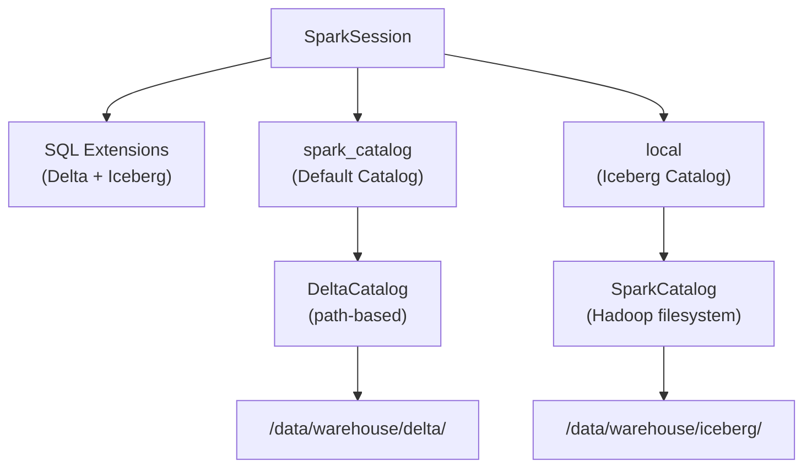
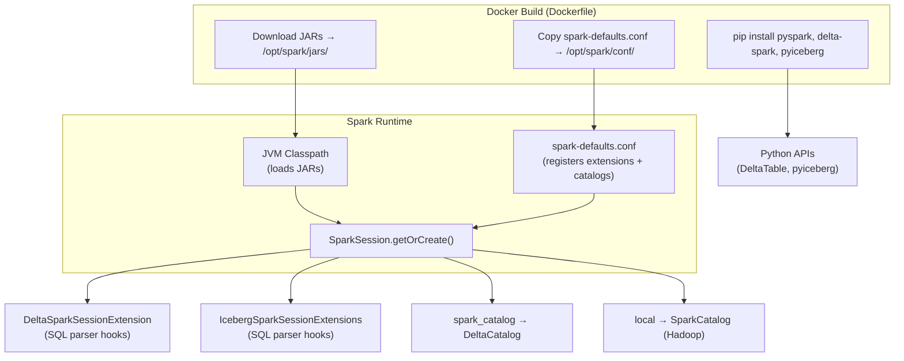
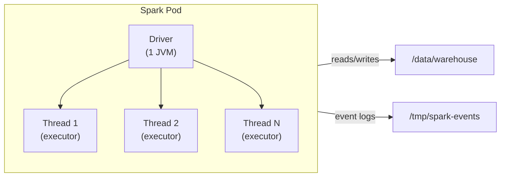

# Spark Configuration

Apache Spark 3.5.3 is the compute engine at the core of the sandbox. It is pre-configured with both **Delta Lake** and **Apache Iceberg** extensions, allowing ACID-transactional data lake operations out of the box.

## Configuration File

**Source:** [`spark-defaults.conf`](../spark-defaults.conf)

This file is baked into the `spark-sandbox` Docker image at `/opt/spark/conf/spark-defaults.conf`. Spark automatically loads it on every session — no manual `--conf` flags or `.config()` calls are needed.

```
# ── Delta Lake ────────────────────────────────────────────────
spark.sql.extensions                io.delta.sql.DeltaSparkSessionExtension,
                                    org.apache.iceberg.spark.extensions.IcebergSparkSessionExtensions
spark.sql.catalog.spark_catalog     org.apache.spark.sql.delta.catalog.DeltaCatalog

# ── Iceberg ───────────────────────────────────────────────────
spark.sql.catalog.local             org.apache.iceberg.spark.SparkCatalog
spark.sql.catalog.local.type        hadoop
spark.sql.catalog.local.warehouse   /data/warehouse/iceberg
```

## Catalog Architecture



### `spark_catalog` — Delta Lake (Default)

**Configuration property:** `spark.sql.catalog.spark_catalog = org.apache.spark.sql.delta.catalog.DeltaCatalog`

`spark_catalog` is Spark's built-in default catalog. By assigning it the `DeltaCatalog` implementation, every table-related operation that doesn't specify an explicit catalog is routed through Delta Lake. This is the deepest possible integration — Delta becomes the default table format.

**How it works under the hood:**

1. **Extension registration** — `DeltaSparkSessionExtension` hooks into the Spark SQL parser to recognize Delta-specific syntax (`MERGE INTO`, `DESCRIBE HISTORY`, `VACUUM`, etc.)
2. **Catalog override** — `DeltaCatalog` wraps Spark's default `SessionCatalog`, intercepting table creation and reads to apply Delta format automatically
3. **Path-based storage** — Unlike Iceberg, Delta tables don't require catalog registration. You point Spark at a directory path and Delta manages the `_delta_log/` transaction log within that directory

**Physical layout of a Delta table:**
```
/data/warehouse/delta/employees/
├── _delta_log/                    Transaction log (JSON + Parquet checkpoints)
│   ├── 00000000000000000000.json  Version 0 — initial write
│   ├── 00000000000000000001.json  Version 1 — merge/update
│   └── ...
├── part-00000-....snappy.parquet  Data files (Parquet format)
├── part-00001-....snappy.parquet
└── ...
```

Each write operation creates a new JSON commit file in `_delta_log/`. The transaction log provides:
- **ACID guarantees** — concurrent reads never see partial writes
- **Time travel** — each version is a complete snapshot; read any version with `option("versionAsOf", N)`
- **Audit trail** — `DeltaTable.forPath(...).history()` shows every operation with timestamps

**Key Delta operations enabled by the extension:**

| SQL Command | Purpose |
|---|---|
| `MERGE INTO target USING source ON condition` | Upsert (insert or update matching rows) |
| `DELETE FROM table WHERE condition` | Delete rows by predicate |
| `UPDATE table SET col = val WHERE condition` | Update rows in place |
| `OPTIMIZE table` | Compact small files into larger ones |
| `VACUUM table` | Remove old files no longer referenced by the log |
| `DESCRIBE HISTORY table` | Show version history |

### `local` — Apache Iceberg

**Configuration properties:**
```
spark.sql.catalog.local             = org.apache.iceberg.spark.SparkCatalog
spark.sql.catalog.local.type        = hadoop
spark.sql.catalog.local.warehouse   = /data/warehouse/iceberg
```

The `local` catalog is a custom Iceberg `SparkCatalog` registered under the name `local`. The choice of name is arbitrary — it could be called anything (e.g., `iceberg`, `warehouse`, `my_catalog`). The name `local` was chosen to reflect that it uses local filesystem storage rather than a remote metastore.

**How it works under the hood:**

1. **Catalog type: `hadoop`** — This is Iceberg's `HadoopCatalog` implementation. It uses the local filesystem (or any Hadoop-compatible filesystem) to store both table metadata and data. There is no external metastore service (like Hive Metastore or AWS Glue) — all metadata lives as files on disk.

2. **Warehouse path** — `/data/warehouse/iceberg` is the root directory. When you create `local.mydb.products`, Iceberg creates the directory structure:
   ```
   /data/warehouse/iceberg/
   └── mydb/                          Namespace (database)
       └── products/                  Table
           ├── metadata/              Iceberg metadata files
           │   ├── v1.metadata.json   Table schema, partition spec, snapshots
           │   ├── v2.metadata.json   Updated after each write
           │   ├── snap-<id>.avro     Snapshot manifest list
           │   └── <id>-m0.avro       Manifest files (track data files)
           └── data/                  Actual data files
               ├── 00000-0-....parquet
               └── ...
   ```

3. **Namespace model** — Iceberg uses a hierarchical `catalog.namespace.table` addressing scheme:
   - `local` — the catalog (registered in `spark-defaults.conf`)
   - `mydb` — the namespace (created with `CREATE NAMESPACE`)
   - `products` — the table

4. **Extension registration** — `IcebergSparkSessionExtensions` adds Iceberg-specific SQL syntax and stored procedures

**Key Iceberg operations enabled by the extension:**

| SQL Command | Purpose |
|---|---|
| `CREATE NAMESPACE local.mydb` | Create a namespace for organizing tables |
| `CREATE TABLE local.mydb.t (...) USING iceberg` | Create a managed Iceberg table |
| `ALTER TABLE local.mydb.t ADD COLUMN col TYPE` | Schema evolution (no data rewrite) |
| `SELECT * FROM local.mydb.t.snapshots` | View snapshot history |
| `SELECT * FROM local.mydb.t.history` | View table change history |
| `SELECT * FROM local.mydb.t.files` | List data files |
| `CALL local.system.rollback_to_snapshot('mydb.t', id)` | Rollback to a previous snapshot |

**Delta vs. Iceberg — when to use which:**

| Aspect | Delta Lake | Iceberg |
|---|---|---|
| **Access model** | Path-based (`spark.read.format("delta").load(path)`) | Catalog-based (`spark.table("local.db.table")`) |
| **Table creation** | Implicit (first write creates the table) | Explicit (DDL required: `CREATE TABLE ... USING iceberg`) |
| **Schema evolution** | Limited (add columns, change nullability) | Full (add, drop, rename, reorder columns) |
| **Time travel** | By version number | By snapshot ID or timestamp |
| **Metadata** | JSON transaction log in `_delta_log/` | Avro/JSON metadata in `metadata/` |
| **Best for** | Quick writes, simple analytics, path-based workflows | Governed tables, schema-heavy workloads, catalog management |

Both formats are available simultaneously and can even reference the same source data (though they maintain separate metadata).

## SQL Extensions

The `spark.sql.extensions` property registers two extensions:

| Extension | Provides |
|---|---|
| `io.delta.sql.DeltaSparkSessionExtension` | `MERGE INTO`, `DELETE FROM`, `UPDATE`, `OPTIMIZE`, `VACUUM`, `DESCRIBE HISTORY` |
| `org.apache.iceberg.spark.extensions.IcebergSparkSessionExtensions` | `ALTER TABLE ... ADD COLUMN`, snapshot management, `CALL` procedures |

Both extensions are loaded simultaneously and do not conflict.

## Data Paths

| Path | Purpose | Accessed via |
|---|---|---|
| `/data/warehouse/landing/` | Raw uploaded files (CSV, TSV, Parquet) | `spark.read.csv(...)` / dashboard API |
| `/data/warehouse/delta/` | Delta Lake tables | `spark.read.format("delta").load(path)` |
| `/data/warehouse/iceberg/` | Iceberg tables (managed by `local` catalog) | `spark.table("local.db.table")` |
| `/data/warehouse/output/` | General-purpose job output | Custom write paths |
| `/tmp/spark-events/` | Spark event logs (for History Server) | Automatic when `spark.eventLog.enabled=true` |

## JARs (Auto-loaded)

These JARs are placed in `/opt/spark/jars/` and loaded automatically by every Spark session:

| JAR | Version | Maven Coordinates | Role |
|---|---|---|---|
| `iceberg-spark-runtime-3.5_2.12` | 1.6.1 | `org.apache.iceberg:iceberg-spark-runtime-3.5_2.12:1.6.1` | Iceberg table format runtime for Spark 3.5 (includes `SparkCatalog`, `IcebergSparkSessionExtensions`, readers/writers) |
| `delta-spark_2.12` | 3.2.1 | `io.delta:delta-spark_2.12:3.2.1` | Delta Lake core engine (includes `DeltaCatalog`, `DeltaSparkSessionExtension`, `DeltaTable` API) |
| `delta-storage` | 3.2.1 | `io.delta:delta-storage:3.2.1` | Delta Lake storage abstraction layer (log store, file system operations) |

JARs in `/opt/spark/jars/` are on Spark's classpath at startup. This means:
- No `--packages` or `--jars` flags needed when running `spark-submit`
- No `.config("spark.jars.packages", ...)` calls needed in notebooks
- The classes referenced in `spark-defaults.conf` (like `DeltaCatalog` and `SparkCatalog`) are always resolvable

### How it all connects



## Job Execution Model

### Local Mode (`local[*]`)

All Spark jobs in the sandbox run with `--master local[*]`, which means:
- The **driver** and all **executors** run inside a single JVM within the pod
- `[*]` uses **all available CPU cores** on the pod
- No separate Spark master or worker processes are needed
- Simpler to manage but limited to the resources of a single pod



### spark-submit Command

When the dashboard launches a job, it creates a Kubernetes Job with this command:

```bash
/opt/spark/bin/spark-submit \
    --master local[*] \
    --conf spark.eventLog.enabled=true \
    --conf spark.eventLog.dir=/tmp/spark-events \
    /tmp/jobs/<filename>.py
```

- `spark.eventLog.enabled=true` — writes event logs so the History Server can display job metrics
- `spark.eventLog.dir=/tmp/spark-events` — shared with the History Server via a `hostPath` volume

### SparkSession in Notebooks

In Jupyter notebooks, the SparkSession is created directly in Python:

```python
from pyspark.sql import SparkSession

spark = (
    SparkSession.builder
    .master("local[*]")
    .appName("MyNotebook")
    .getOrCreate()
)
```

Since `spark-defaults.conf` is pre-loaded, both Delta and Iceberg catalogs are immediately available — no additional `.config()` calls are needed.

## Code Examples

### Delta Lake Operations

```python
# Write a DataFrame as a Delta table
df.write.format("delta").mode("overwrite").save("/data/warehouse/delta/my_table")

# Read the latest version
spark.read.format("delta").load("/data/warehouse/delta/my_table").show()

# Time travel — read a specific version
spark.read.format("delta").option("versionAsOf", 0).load("/data/warehouse/delta/my_table").show()

# Upsert with MERGE
from delta.tables import DeltaTable
dt = DeltaTable.forPath(spark, "/data/warehouse/delta/my_table")
dt.alias("t").merge(
    updates_df.alias("u"), "t.id = u.id"
).whenMatchedUpdateAll().whenNotMatchedInsertAll().execute()

# View table history
dt.history().select("version", "timestamp", "operation").show()
```

### Iceberg Operations

```python
# Create a namespace and table
spark.sql("CREATE NAMESPACE IF NOT EXISTS local.mydb")
spark.sql("""
    CREATE TABLE IF NOT EXISTS local.mydb.events (
        id INT, name STRING, ts TIMESTAMP
    ) USING iceberg
""")

# Insert data
spark.sql("INSERT INTO local.mydb.events VALUES (1, 'click', current_timestamp())")

# Query
spark.table("local.mydb.events").show()

# Schema evolution
spark.sql("ALTER TABLE local.mydb.events ADD COLUMN source STRING")

# View snapshot history
spark.sql("SELECT snapshot_id, committed_at, operation FROM local.mydb.events.snapshots").show()

# Time travel by snapshot ID
spark.read.option("snapshot-id", snapshot_id).table("local.mydb.events").show()
```

### Reading Landing Zone Files

```python
# CSV
df = spark.read.option("header", "true").option("inferSchema", "true") \
    .csv("/data/warehouse/landing/data.csv")

# TSV
df = spark.read.option("sep", "\t").option("header", "false") \
    .csv("/data/warehouse/landing/data.tsv")

# Parquet
df = spark.read.parquet("/data/warehouse/landing/data.parquet")
```

---

[Back to README](../README.md)
